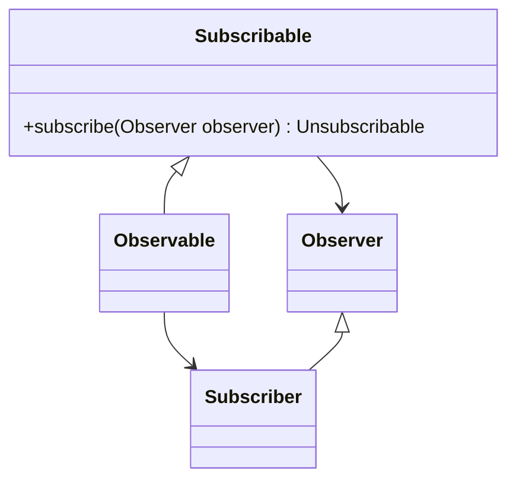

# Conceptos básicos de POO

1. **Diferencia entre clase y objeto**

   Una clase es una estructura de datos que moldea un comportamiento con base en atributos y métodos, los objetos, por su parte, son los que siguen ese comportamiento, siguen al pie de la letra lo que dicta la clase, alterando solo el estado de la estructura, pero no la estructura en sí. En otras palabras, la clase es la que ordena, y los objetos son los que obedecen.

2. **Diferencia entre clase e interfaz**

    Una clase moldea un comportamiento con atributos y métodos, métodos los cuales pueden ser implementados, o no; en caso de que al menos una no, entonces es una clase abstracta. Una interfaz también moldea un comportamiento, pero a un nivel de abstracción superior que una clase, no tiene atributos y está compuesta exclusivamente de métodos abstractos, los cuales deben ser implementados en las clases que la implementen.

3. **¿Qué es polimorfismo?**

    De un conjunto de referencias que apuntan a sus respectivos objetos, objetos los cuales pertenecen a una misma jerarquía de herencia o de interfaz común, el polimorfismo es la capacidad de que cada referencia se comporte de acuerdo a su tipo de objeto, es decir, que cada referencia se comporte de manera diferente, pero bajo la misma orden o contexto.

   1. Ejemplifica con tu proyecto.  
    En el ejemplo del patrón de diseño, Observer, en RxJS está lo siguiente:

En este ejemplo se toda clase que implemente Subscribable debe implementar las funciones que declara, cuyo parametro es un Observer, y como Observer es a su vez una interfaz, no importa qué clase entre como parametro, satisfacerá la función siempre y cuando sea de tipo observer.

1. **¿Qué representa las asociaciones en un diagrama de clases?**
   1. - Código  

    Representa las relaciones entre las clases y como se comunican entre ellas, entre las principales está: herencia, composición, agregación, asociación y dependencia.

2. **Diferencia entre composición vs agregación**
    1. -
    La composición es una relación más fuerte que la agregación, entiéndase por agregación como una formar de _agregar_ objetos a una clase, mientras que composición de _componer_, mientras que en la primera es opcional agregar, por lo tanto, desligar, tanto la clase contenedora como la clase contenida son independientes una de la otra; en la otra tanto la clase contenedora como la clase contenido es considerada un todo, si una se destruye, la otra también.

3. **¿Qué es encapsulamiento?**
   1. ¿Qué ventaja representa?
   2. Ejemplo

    Se refiere a la ocultación de la implementación interna de un objeto y el acceso controlado a sus datos. Esto se logra utilizando modificadores de acceso (como public, private, protected) para restringir el acceso a ciertos componentes de una clase (atributos y métodos).

    Entre las ventajas que representa está el control, ya que a travéz de los getters y setters se controla la escritura y lectura de los datos. Así como abstracción, pues permite a los usuarios de la clase interactuar con ella a través de una interfaz definida, sin necesidad de conocer los detalles internos de su implementación. O modularidad, facilita el cambio o la actualización de la implementación interna de una clase sin afectar a otros componentes del programa, siempre y cuando la interfaz pública permanezca inalterada.

4. ¿De qué manera se representa la modularidad en POO?
   1. Ejemplo

    La modularidad se ve reflejada en la clases y el encapsulamiento, mientras que la modularidad se refiere a la división de un programa en partes más pequeñas, en este sentido cada clase está destinada a cumplir una serie de tareas específicas, y el encapsulamiento permite que la implementación de estas tareas específicas estén ocultas a los usuarios de la clase, de esta manera se logra la modularidad.

    Por ejemplo, en el patrón de diseño Observer, la clase Observable es la encargada de notificar a los observadores de los cambios que se producen en el objeto observado, mientras que la clase Observer es la encargada de recibir las notificaciones del objeto observado.

5. Considera polimorfismo.
   1. ¿Cuáles la diferencia de usar Herencia vs Interfaces?

    Mientras que en el uso de herencia se _herendan_ todos los atributos y métodos de la clase padre, listos para usarse; el uso de interfaces representa un contrato, es decir, se declara una serie de métodos que deben ser implementados en las clases que la implementen, pero no se heredan los métodos, por lo que se debe implementar cada uno de ellos.

   2. Ventajas y desventajas

    Entre las ventajas de la herencia, está el hecho de que es un mecanismo de reutilización de código, es de fácil implementación, y ofrece relaciones fuertess sin embargo esto implica que haya un grado de acomplamiento fuerte, se limite a herencia simple y puede llevar jerarquías demasiado complejas.

    Por otro las interfaces permiten la implementación de múltiples interfaces, lo que permite una mayor flexibilidad, y no hay un grado de acomplamiento fuerte, sin embargo, no se puede reutilizar código, y se debe implementar cada método de la interfaz, lo que a comparación de la herencia su implementación es más laboriosa.
